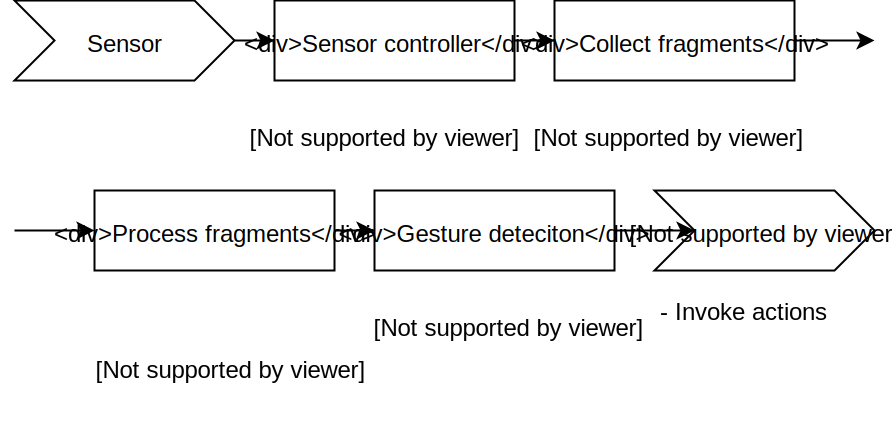

# Planning

## Week mapping
* **Week 3 - 6: Implementation of platform**
* Week 7: Writing user manual (3 days)
* Week 7: Conducting experiments (2 days)

# Last week

## Development
* Build pipeline
* Extend `leap-rs` library
* Circular measurements, additional processing
* CI

## Pipeline

# This week

## Continue development
* Record gesture templates
* Build web configuration panel
* Real-time gesture detection

# Thanks!

## Any questions?

Slides:  
[gitlab.com/timvisee/cant-touch-this-project](https://gitlab.com/timvisee/cant-touch-this-project)

Project:  
[gitlab.com/timvisee/cant-touch-this](https://gitlab.com/timvisee/cant-touch-this)
